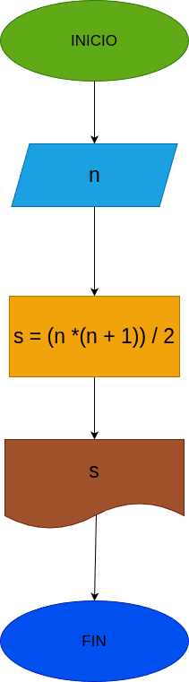

# Suma_n_Números
Suma de los n primeros números náturales 

# Analisis

## Input

### Variables de entrada
n: número al que se desea aplicar la formula
### prosesisng
s: suma de los primeros n números 

s = (n*(n+1))/2 

### output
s
# Diseño

 
# Construcción